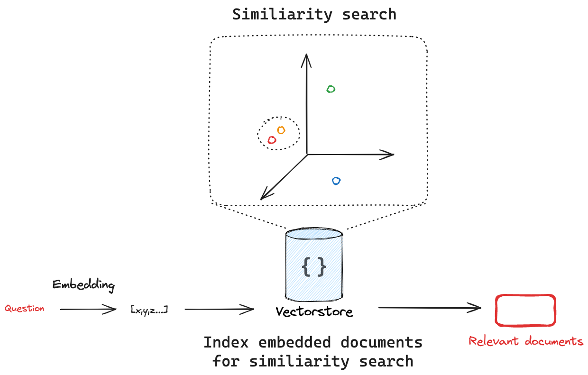
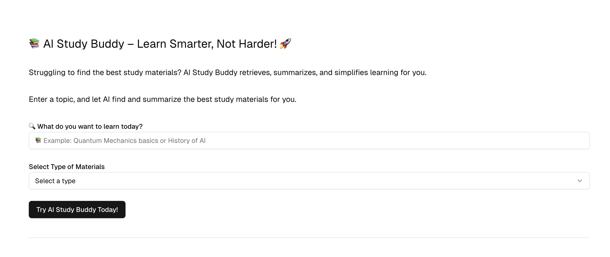
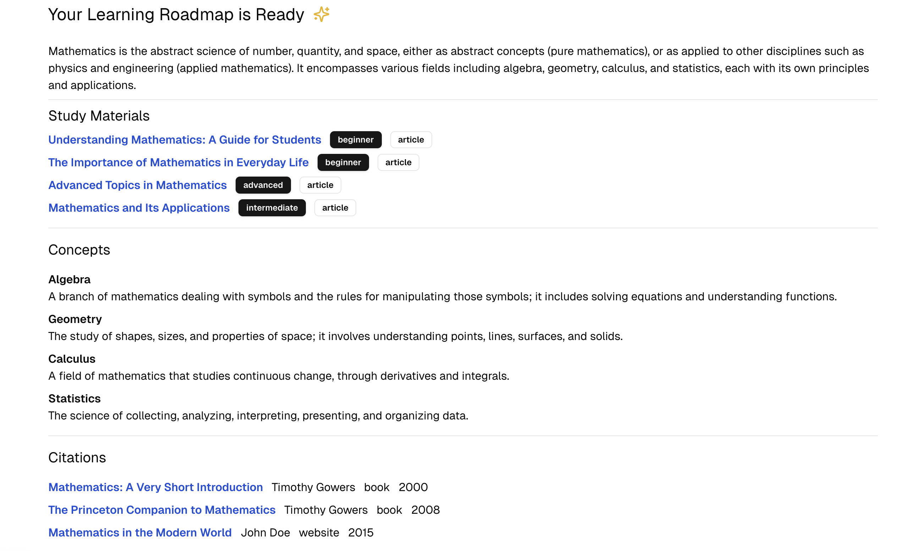
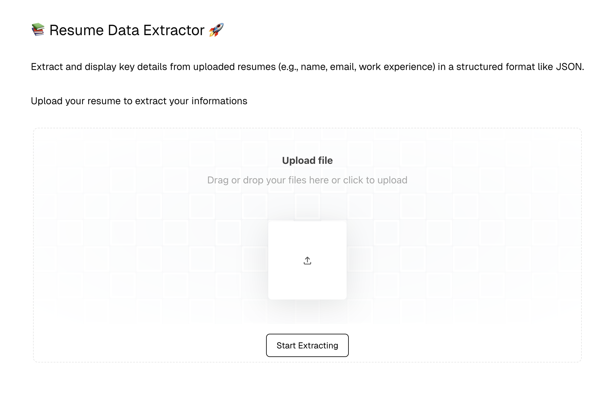
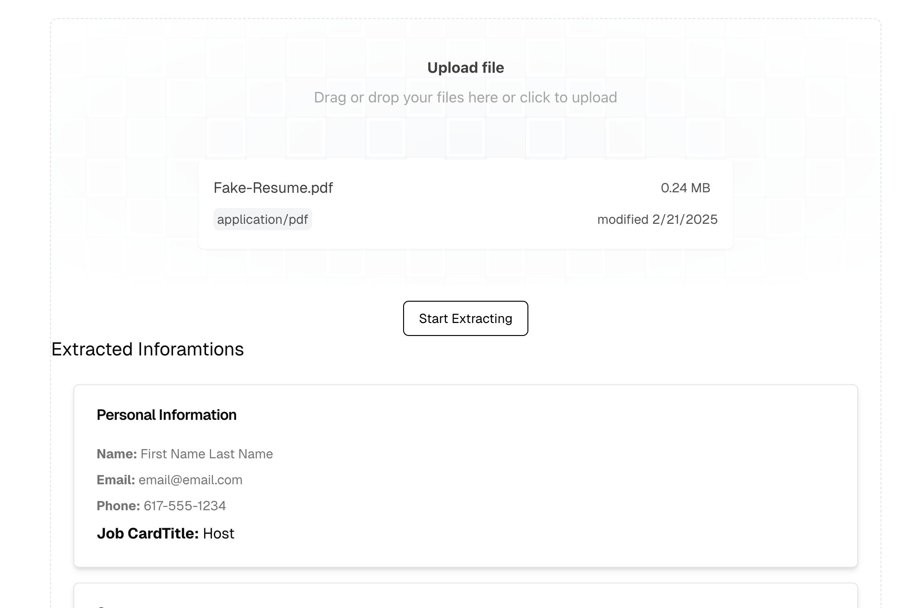
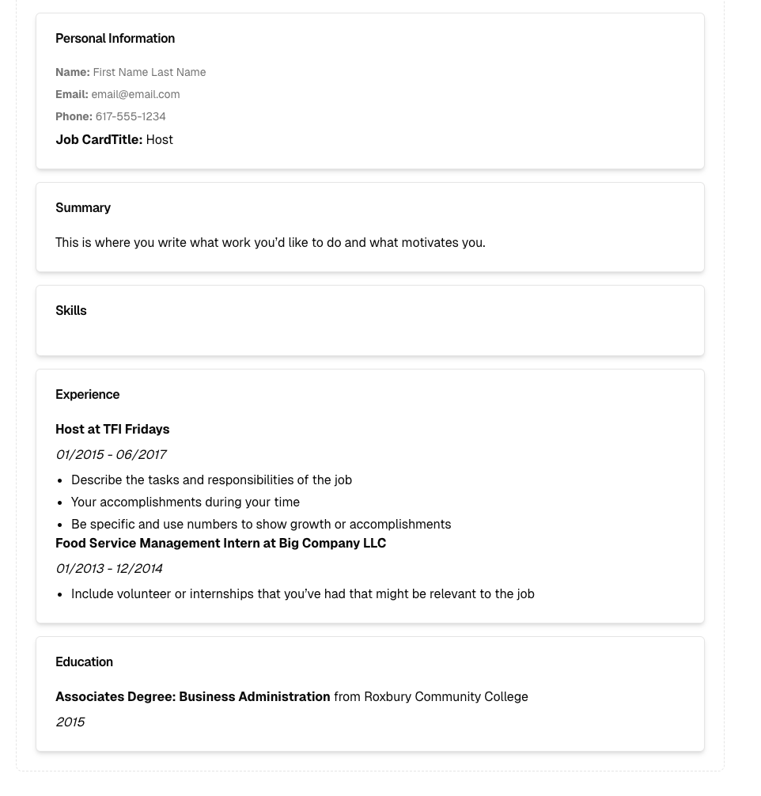

# Learn LangChain By Building Projects (Working on it)

Code for building ToolLLM with LangGraph.js

Building LLM APP with js and openai

projects are under ai-rag-app

---

## langchain concepts

- Chat Model
LangChain provides a consistent interface for working with chat models from different providers while offering additional features for monitoring, debugging, and optimizing the performance of applications that use LLMs.

- Tool calling 
it enables the ai to interact with external services, APIs, and databases. it also extracts sturctured information from unstructured data and perform various other tasks.

  (1) Tool Creation: Use the tool function to create a tool. A tool is an association between a function and its schema.
  
  (2) Tool Binding: The tool needs to be connected to a model that supports tool calling. This gives the model awareness of the tool and the associated input schema required by the tool. 
  
  (3) Tool Calling: When appropriate, the model can decide to call a tool and ensure its response conforms to the tool's input schema. 
  
  (4) Tool Execution: The tool can be executed using the arguments provided by the model.

- Structured output
it returns the response in a stuctured format, such as JSON to match a given schema

- Multimodality
work with multiple types of data: text, images, audio, and video

- Key methods
  The key methods of a chat model are:

  - invoke: The primary method for interacting with a chat model. It takes a list of messages as input and returns a list of messages as output.
  - stream: A method that allows you to stream the output of a chat model as it is generated.
  - batch: A method that allows you to batch multiple requests to a chat model together for more efficient processing.
  - bindTools: A method that allows you to bind a tool to a chat model for use in the model's execution context.
  - withStructuredOutput: A wrapper around the invoke method for models that natively support structured output.
---

#### Embedding Models

- Embedding models: Input text, output numerical vectors representing semantic meaning.

- Application: Enables semantic search by comparing these vectors, not just keywords.

- langchain allows us to embed doucments or embed queries

- Measuring similarity: we use similarity metrics two measure how to two texts are similar after converting them into numerical vectors

- common metrics:

  - Cosine Similarity: Measures the cosine of the angle between two vectors.
  - Euclidean Distance: Measures the straight-line distance between two points.
  - Dot Product: Measures the projection of one vector onto another.

- **Vector stores** are frequently used to search over unstructured data, such as text, images, and audio, to retrieve relevant information based on semantic similarity rather than exact keyword matches.

- we split text in langchain for better performance and for token limit

## AI-Powered Personalized Learning Assistant

Building AI RAG Application with LangChain & Next.js

Helps students & professionals retrieve relevant learning materials

👉 Use Case: A student inputs a topic, and the AI retrieves and summarizes the most relevant study materials from online sources, books, or PDFs.

* **User Input:**
    * Topic input: `User Input` -> `AI Processing`
    * Material type selection: `User Selection` -> `AI Filtering`
* **AI Processing:**
    * Uses LangChain and OpenAI (gpt-4o-mini) to:
        * Summarize the topic.
        * Generate a list of relevant study materials.
        * Identify key concepts.
        * Provide source citations.
* **Output:**
    * `AI Response (JSON)` -> `Roadmap Display`
    * Displays:
        * Summary
        * Study materials (title, URL, difficulty, type).
        * Key concepts (concept, description).
        * Source citations (title, author, year, URL, type).
* **Components:**
    * `MaterialsGenerator` (React component)
    * `/api/retrieve-response` (Next.js API route)
    * `LearningMaterialSchema` (Zod schema)

  

  

---

## Resume Extractor Feature

This feature extracts structured data from uploaded resume PDFs.

* **File Upload:**
    * `User Uploads PDF` -> `FormData`
* **PDF Processing:**
    * `FormData` -> `/api/resume-structured-data` (Next.js API)
    * API:
        * Saves PDF temporarily.
        * Parses PDF text using `pdfjs-dist`.
        * `Parsed Text` -> `LangChain/OpenAI (gpt-4o-mini)`
        * Uses `ChatPromptTemplate` and `JsonOutputParser` to extract structured data based on a defined schema.
        * `AI Response (JSON)` -> `Structured Data`
* **Data Display:**
    * `Structured Data` -> `ResumeDisplay` (React component)
    * Displays extracted information in a structured card format:
        * Personal information (name, email, etc.).
        * Summary.
        * Skills.
        * Experience.
        * Education.
        * Certifications, projects, awards, etc.
* **Components:**
    * `ResumeExtractor` (React component, file upload and request).
    * `ResumeDisplay` (React component, data visualization).
    * `/api/resume-structured-data` (Next.js API route, PDF parsing and AI processing).
    * `Resume` (TypeScript interface).
    * `FileUpload` (UI component). 

  

  

  

## Streaming

LangChain's streaming concept enhances user experience by progressively displaying outputs from large language models (LLMs) as they are generated. Instead of waiting for a complete response, users can see intermediate results in real-time, reducing perceived latency and improving responsiveness

